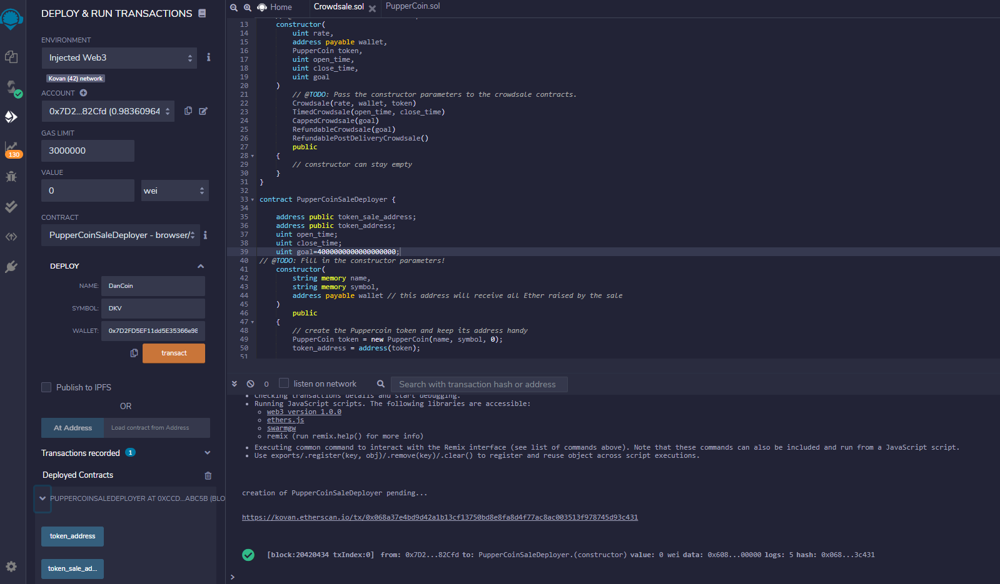
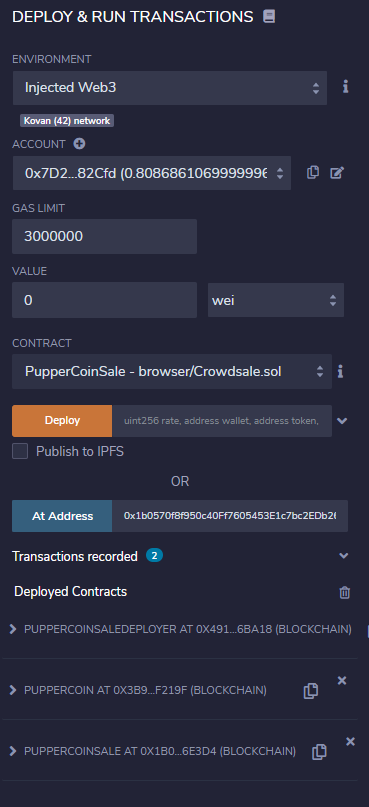
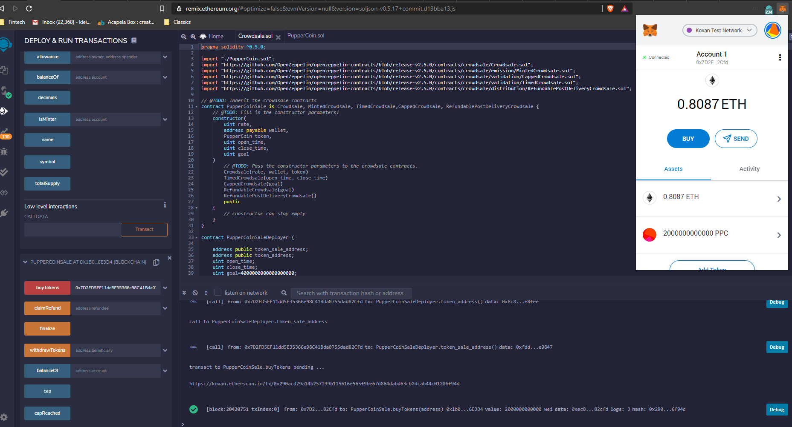

# Fintech Bootcamp - Advance Solidity Homework - Daniel Klein Velderman

- Deploy PupperCoin SaleDeployer by creating a NAME (PupperCoin), SYMBOL (PPC) and specifying the beneficiary WALLET (to receive the ETH)
- Deploy PupperCoin contract using the token address created in step 1
- Deploy PuypperCoinSale contract using the token sale address created in step 1
- Buy tokens in PupperCoinSale contract
- Add newly created token in Metamask plugin by copying the PupperCoin Sale contract address into Metamask (Custom token)
- Our newly created and bought tokens now show up!

