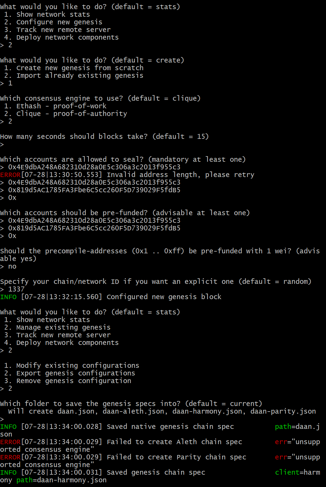
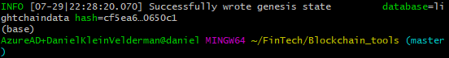
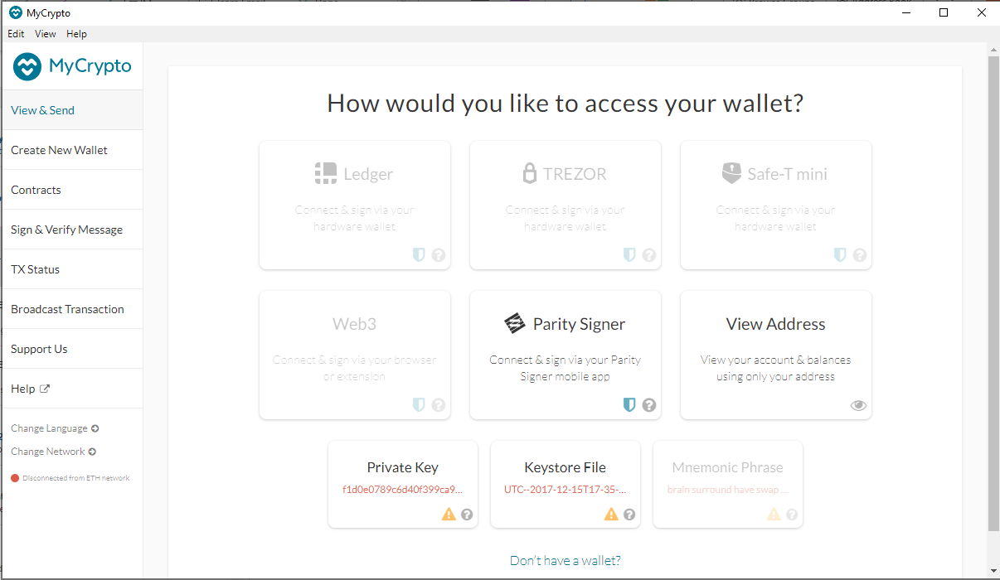
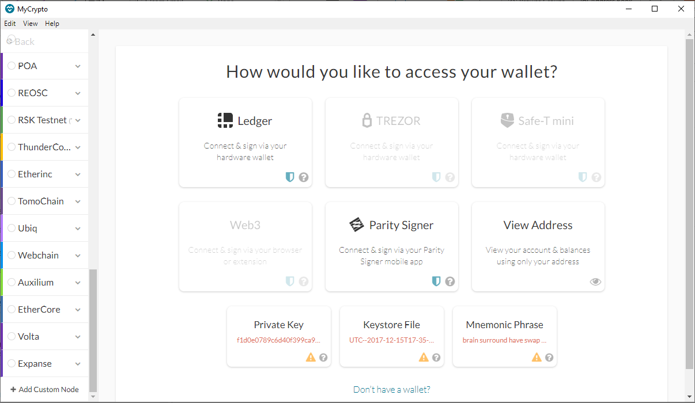
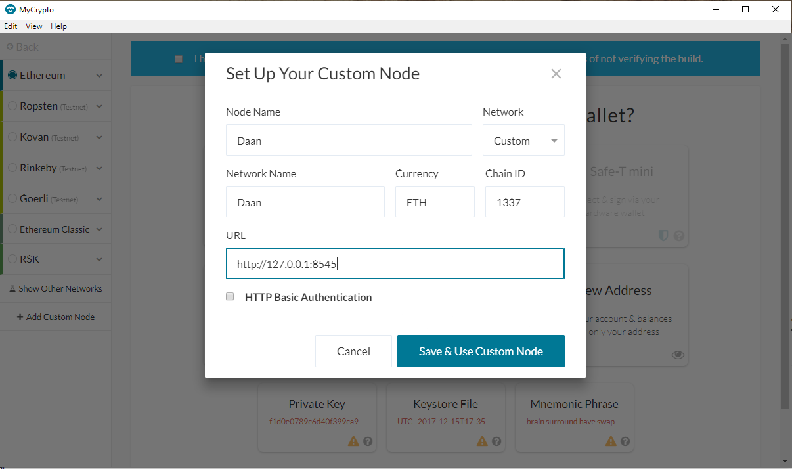
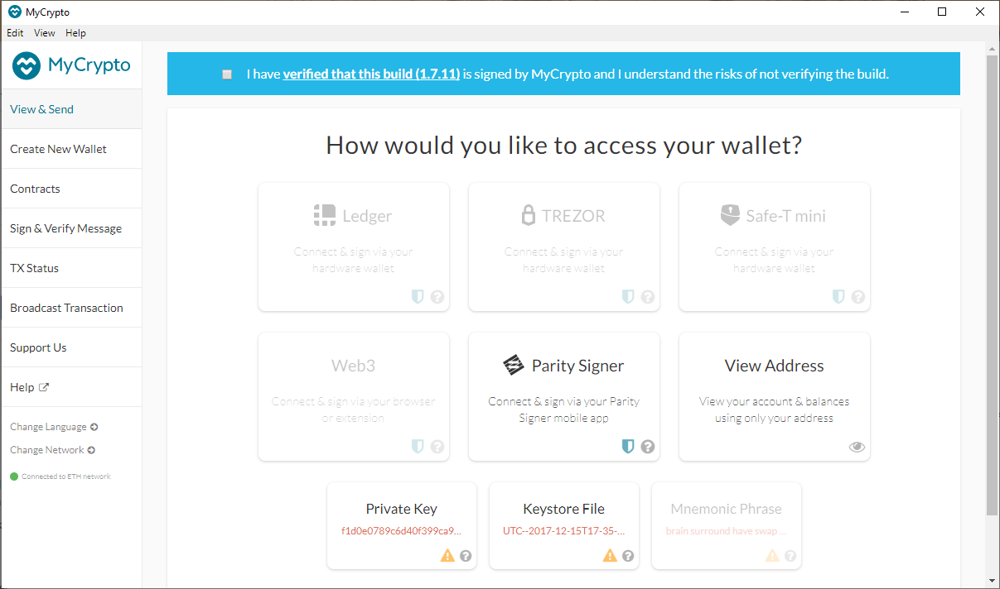
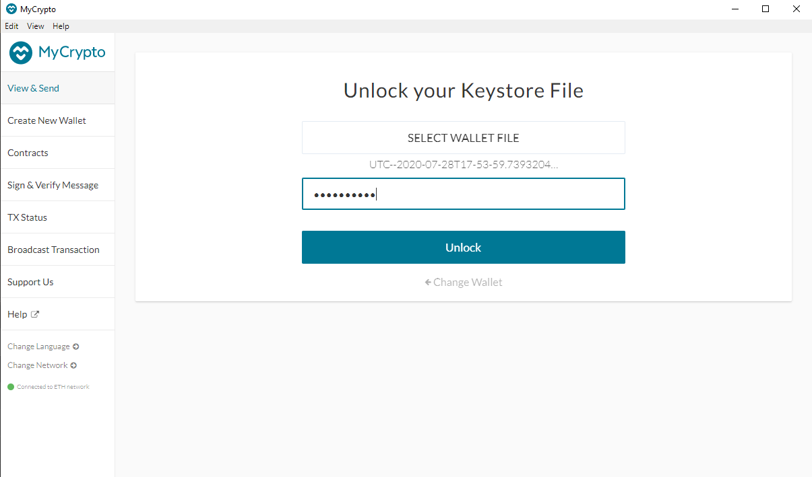
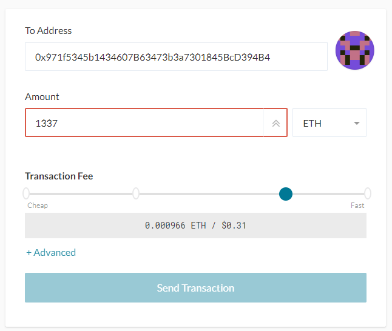
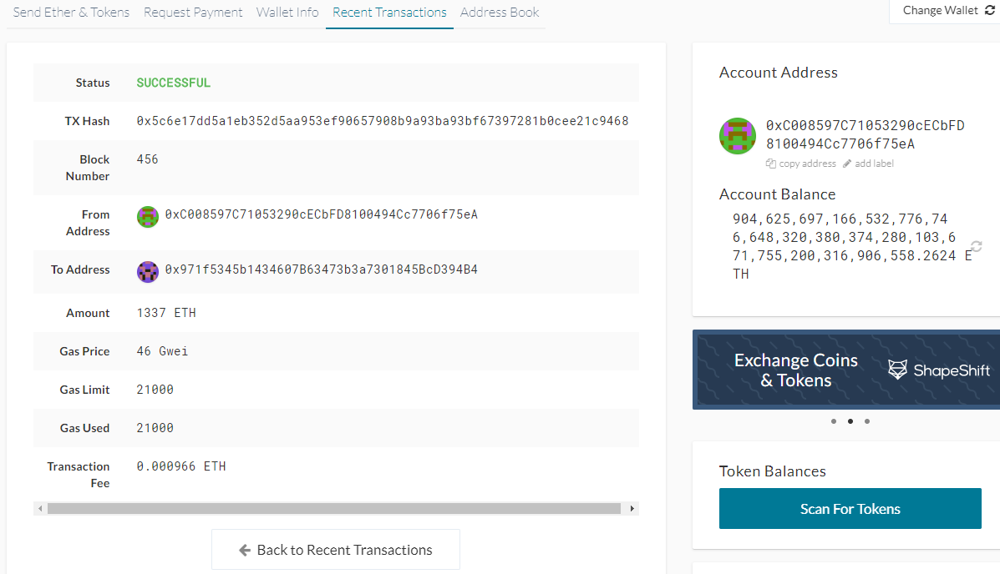

# Fintech Bootcamp - Blockchain Homework - Daniel Klein Velderman

1. In order to create a blockchain and interact with it, the following installs need to be done:
    - MyCrypto (manage Ethereum wallets) https://download.mycrypto.com/
    - Go Ethereum tools (specifically Geth and Puppeth to create a blockchain) https://geth.ethereum.org/downloads/

2. For the purposes of the assignment at ZBank we will be working with the Proof of Authority ("PoA") consensus algorithm
    - The network we will be creating is referred to as "DAAN", Decentralised Accelerated Ardent Network (I realize that with PoA decentralization is not possible, but we are testing for now, moving on the our Decentralized mainnet at a later stage)
    - As we need to prefund accounts using PoA we will start with creating two nodes

3. Create two nodes:
    - ./geth account new --datadir daan_node1
        - Public address of the key:   0xC008597C71053290cECbFD8100494Cc7706f75eA
    - ./geth account new --datadir daan_node2
        - Public address of the key:   0x971f5345b1434607B63473b3a7301845BcD394B4

4. With the two node addresses we can create our Genesis block
    - We use ./puppeth to create a genesis block from scratch using PoA (Clique) and paste the two node addresses to prefund
    - Chain ID is what we use later on to connect to our network with MyCrypto, gave it 1337
    - Blocktime kept at default 15 seconds, for our testing purposes that is fine; time it takes to create a new block

5. Now we go back to ./puppeth and export our genesis configuration daan.json and subsequently initialize the nodes:
    - ./geth init daan.json --datadir daan_node1
    - ./geth init daan.json --datadir daan_node2

6. Starting the blockchain
    - starting daan_node1: ./geth --datadir daan_node1 --mine --miner.threads 1
    - starting daan_node2: ./geth --datadir node2 --port 30304 --rpc --bootnodes enode (copy/paste daan_node1 enode address) -ipcdisable

7. Re-establish connection
    - ./geth --datadir daan_node1 --unlock "C008597C71053290cECbFD8100494Cc7706f75eA" --mine --rpc --allow-insecure-unlock
    - ./geth --datadir daan_node2 --unlock "971f5345b1434607B63473b3a7301845BcD394B4" --mine --port 30304 --bootnodes enode (copy/paste daan_node1 enode address) --miner.threads 1 --ipcdisable

8. Flags
    - --rpc enables communication to a second node, thus allowing MyCrypto to do transactions on the chain
    - As daan_node1 took up port 30303, daan_node2 listens to 30304
    - --bootnodes enables finding daan_node1 (or other nodes if any)
    - --ipcdisable is required on Windows as Windows does not allow for having multiple sockets running from geth simultaneously due to the way it spawns new IPC/Unix sockets. As we are using only rpc for now, we can disable ipc.
    - --mine telle the node to mine new blocks
    - --minerthreads instruct the amount of CPU threads to use during mining, for our testing purposes 1 is sufficient (low difficulty)

9. Using MyCrypto to connect to DAAN and make transactions

    - After install MyCrypto, homepage should look like this

    - Our DAAN network needs to be setup, so we go to 'change network' on the bottom left and select '+ Add Custome Node'

    - Next we fill in the custom_node details, making sure to enter the right Chain-ID we choose when creating our Genesis block. Also, we need to connect to our local host (since we're still testing) which listens to http://127.0.0.1:8545. We type ETH as currency since this is what we want to transact with.
    - MyCrypto will connect to the nodes running in the background on our local host.

    - Now we can enter our wallet by choosing 'Keystore' on the Homepage and browse to our daan_node1 Keystore (UTC) file in the concerning folder. After entering the password we gave daan_node1 earlier, we enter our wallet.

    - Now it is time to send a transaction from daannode1 to daannode2!

    - Successful!

Challenge mode
---

10. Create a separate bootnode dedicated to connecting peers together

- in blockchain tools directory run ./bootnode -genkey daan.key
    - -genkey flag creates the bootnode key (daan.key in this case)
- then run ./bootnode -nodekey daan.key -addr :30305
    - -nodekey flag points to the daan.key to run
    - -addr flag assigns the port
- copy/paste the generated enode when starting the node

11. There will be a new DevOps engineer joining the team, add an additional sealer address to the network on the fly!

- Generate a new node as we did before (./geth account new --datadir daan_node3)
- in the running nodes gitbash windows type:
- clique.propose("0xNODE3_ADDRESS", true)
    - authorizes the new signer, should be authorized by more than 50% of the nodes. As such in this case daan_node1 and daan_node2 need to authorize, thus run this command in both gitbash running node windows
- clique.proposals
    - shows the current proposals the node is voting on, ie confirms the previous command is being handled
- clique.getSigners()
    - retrieves the list of authorized signers at the specified block, so confirms daan_node3 as authorized (or not)