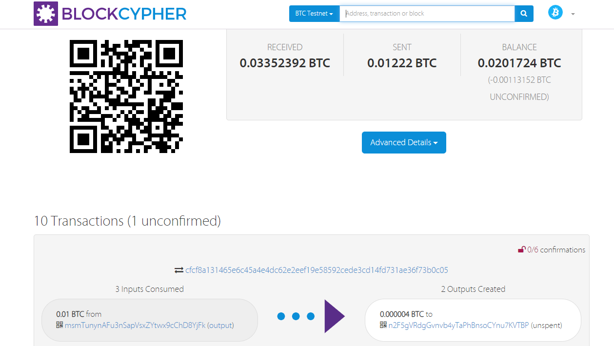
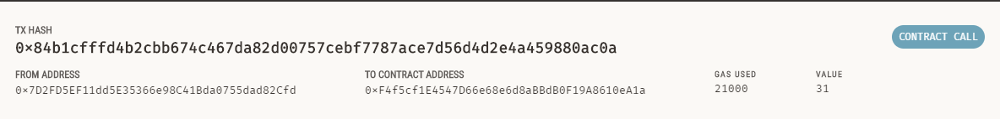

# Fintech Bootcamp - Blockchain Python Homework - Daniel Klein Velderman

1. Transaction

2. The derive HD wallet
hd-wallet-derive is a command-line tool that derives bip32 addresses and private keys for Bitcoin and many altcoins. Derivation reports show privkey (wif encoded), xprv, xpub, and address.

**INSTALL HD WALLET**

- git clone https://github.com/dan-da/hd-wallet-derive
- cd hd-wallet-derive
- php.exe -r "readfile('https://getcomposer.org/installer');" | php
- php.exe -d pcre.jit=0 composer.phar install

to get a derive file in upper tier:
- export MSYS=winsymlinks:nativestrict
- ln -s hd-wallet-derive/hd-wallet-derive.php derive  =>> IN ADMIN MODE

check:

- ./derive -g --mnemonic="INSERT MNEMONIC HERE" --cols=path,address,privkey,pubkey --coin ETH

*Libraries in Python*

make sure to activate a new environment (eg ethereum)

pip install:

- web3.py
- bit